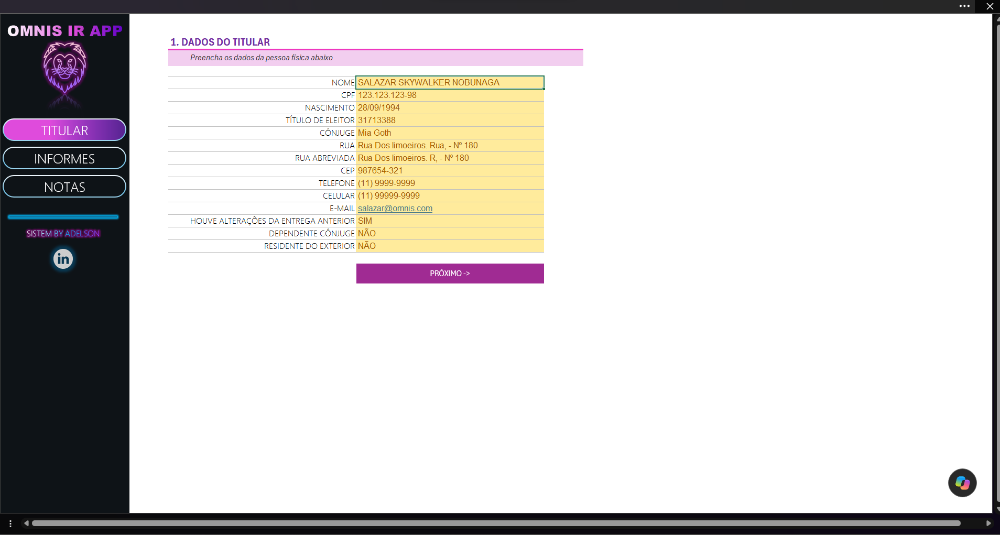
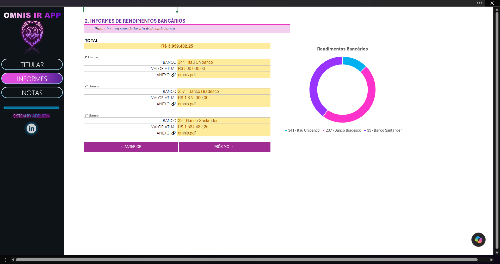
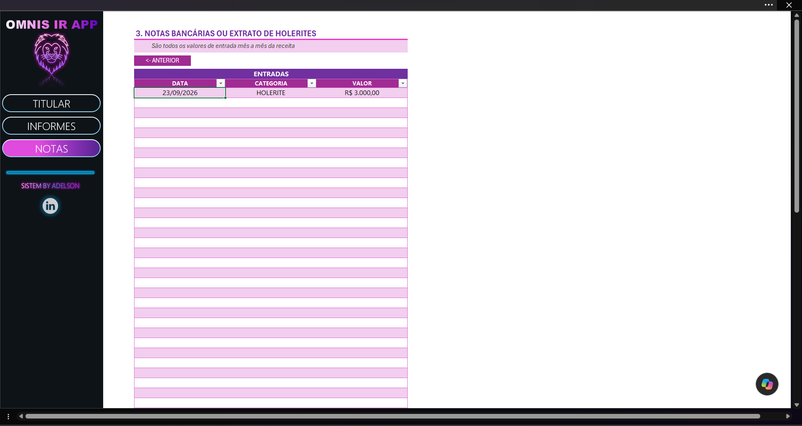

# 📊 OMNIS IR APP — Organizador de Imposto de Renda em Excel

O **OMNIS IR APP** é um organizador de informações para declaração de Imposto de Renda desenvolvido em Microsoft Excel.

A solução centraliza dados do titular, informes bancários e registros de receitas em uma interface estruturada, utilizando recursos nativos do Excel para facilitar o preenchimento, a padronização das informações e a navegação entre as diferentes áreas da planilha.

O projeto foi desenvolvido a partir de uma atividade da formação **Análise de Dados com Excel e IA**, da DIO, e posteriormente personalizado e ampliado para compor meu portfólio.

---

## 🎯 Objetivo

O objetivo do projeto é organizar, em um único arquivo, informações que podem ser utilizadas durante a preparação da declaração de Imposto de Renda.

A solução permite centralizar:

- dados pessoais do titular;
- informações de instituições financeiras;
- valores dos informes bancários;
- documentos de referência;
- receitas recebidas;
- categorias das entradas financeiras.

A proposta é facilitar o registro e a consulta dessas informações por meio de uma interface simples e organizada.

---

## 🖥️ Preview

### 👤 Dados do Titular

Área destinada ao cadastro e organização das principais informações pessoais.



### 🏦 Informes Bancários

Área destinada ao registro dos informes financeiros, valores declarados e documentos relacionados.

A tela também apresenta o valor total consolidado e uma visualização gráfica da distribuição dos valores entre as instituições cadastradas.



### 📝 Registro de Receitas

Área destinada ao registro das entradas financeiras, organizadas por data, categoria e valor.



---

## ⚙️ Funcionalidades

### 👤 Dados do titular

Área destinada ao cadastro das principais informações pessoais necessárias para organização da declaração, incluindo:

- nome;
- CPF;
- data de nascimento;
- título de eleitor;
- informações do cônjuge;
- endereço;
- CEP;
- telefone;
- celular;
- e-mail;
- alterações em relação à declaração anterior;
- dependência de cônjuge;
- residência no exterior.

Alguns campos utilizam validação de dados para restringir as respostas disponíveis e manter a padronização das informações.

---

### 🏦 Informes bancários

Área destinada ao registro das instituições financeiras e dos respectivos valores informados.

A planilha permite:

- selecionar instituições financeiras;
- registrar valores;
- indicar documentos relacionados aos informes;
- consolidar automaticamente os valores cadastrados;
- visualizar graficamente a distribuição dos valores entre as instituições.

O gráfico foi construído a partir de uma estrutura auxiliar vinculada aos dados da área de informes.

---

### 📝 Registro de receitas

A área de notas utiliza uma tabela estruturada para registrar entradas financeiras por meio dos campos:

- data;
- categoria;
- valor.

As categorias utilizam listas de seleção para padronizar os registros e reduzir inconsistências durante o preenchimento.

A área de lançamentos também foi ampliada em relação à estrutura original da atividade para permitir uma quantidade maior de registros.

---

### 🧭 Navegação

O arquivo possui uma interface lateral que permite navegar entre as três principais áreas do organizador:

- Titular;
- Informes;
- Notas.

Também foram utilizados controles de navegação entre as telas, como **Anterior** e **Próximo**.

O objetivo é tornar a utilização mais intuitiva e evitar que o usuário precise navegar manualmente pelas abas do Excel.

---

## 🗂️ Estrutura da planilha

O arquivo está organizado em áreas destinadas ao usuário e abas auxiliares utilizadas pelo funcionamento da solução.

### `TITULAR`

Interface para cadastro e organização dos dados pessoais.

### `INFORMES`

Registro dos informes bancários, valores declarados, documentos relacionados e total consolidado.

### `NOTAS`

Tabela destinada ao registro das receitas e respectivas categorias.

### `GRAPHIC_SUPPORT`

Área auxiliar utilizada como fonte de dados para a visualização gráfica dos valores bancários.

Essa aba permanece oculta para não interferir na utilização da interface principal.

### `TABELAS`

Base auxiliar utilizada para armazenar informações empregadas em listas e validações da aplicação, incluindo a relação de instituições financeiras.

A aba também permanece oculta para manter a interface principal mais limpa.

---

## 🛠️ Recursos utilizados

- Microsoft Excel
- Fórmulas
- Tabelas estruturadas
- Validação de dados
- Listas suspensas
- Formatação de células
- Formatação de valores e identificadores
- Gráfico de rosca
- Hiperlinks e navegação
- Tabelas auxiliares
- Referências entre abas
- Organização e padronização de dados
- Estruturação de interface em planilha

---

## 🎨 Personalizações realizadas

Após acompanhar a construção da versão base durante a formação da DIO, realizei alterações para transformar o exercício em uma versão personalizada para portfólio.

Entre as principais modificações estão:

- criação da identidade visual **OMNIS IR APP**;
- personalização da interface;
- alteração dos elementos visuais e de navegação;
- ampliação da área destinada ao registro de receitas;
- criação de uma área auxiliar para suporte à visualização;
- inclusão de gráfico para comparação dos valores bancários;
- organização de abas auxiliares separadas da interface utilizada pelo usuário;
- ajustes em textos, campos e dados utilizados para demonstração.

---

## 📚 Principais aprendizados

O desenvolvimento deste projeto permitiu praticar recursos do Excel aplicados à organização e estruturação de informações.

Entre os principais aprendizados estão:

- estruturar dados de forma padronizada;
- utilizar validação de dados para controlar entradas;
- utilizar tabelas estruturadas para organizar registros;
- separar informações utilizadas pelo usuário de tabelas auxiliares do sistema;
- utilizar fórmulas para consolidar valores;
- relacionar informações entre diferentes abas;
- utilizar uma estrutura auxiliar como origem de gráficos;
- construir mecanismos de navegação dentro do Excel;
- organizar uma interface pensando na experiência do usuário;
- adaptar e ampliar uma solução existente a partir da compreensão de sua estrutura.

O projeto também reforçou a importância de pensar não apenas nas funcionalidades de uma planilha, mas na forma como os dados serão inseridos, organizados, consultados e apresentados ao usuário.

---

## 📂 Estrutura do repositório

```text
organizador-ir-excel/
│
├── images/
│   ├── titular.png
│   ├── informes.png
│   └── notas.png
│
├── organizador-ir.xlsx
│
└── README.md
```

---

## 🚀 Como utilizar

1. Baixe o arquivo `organizador-ir.xlsx`.
2. Abra o arquivo no Microsoft Excel.
3. Utilize o menu lateral para navegar pelas áreas do organizador.
4. Preencha os dados do titular.
5. Registre os informes das instituições financeiras.
6. Utilize a área de notas para registrar as entradas financeiras.
7. Consulte o total e a visualização dos valores cadastrados.

---

## 🔐 Dados utilizados

Os dados apresentados na versão publicada neste repositório são **fictícios** e utilizados exclusivamente para demonstrar o funcionamento da solução.

Por se tratar de um projeto relacionado a informações pessoais e financeiras, dados reais como CPF, endereço, telefone, documentos e valores bancários não devem ser publicados em repositórios públicos.

---

## 📖 Origem do projeto

Projeto desenvolvido a partir de uma atividade prática da formação **Análise de Dados com Excel e IA**, oferecida pela **DIO**.

A estrutura apresentada durante a formação foi utilizada como base de aprendizado e posteriormente personalizada e ampliada para fins de estudo e portfólio.

---

## 👨‍💻 Autor

**Adelson Sa Nobre**

Estudante de Ciência de Dados, desenvolvendo conhecimentos em Excel, Power Query, SQL, Power BI e análise de dados.

Este projeto faz parte do meu portfólio de estudos e acompanha minha evolução na área de Dados.
